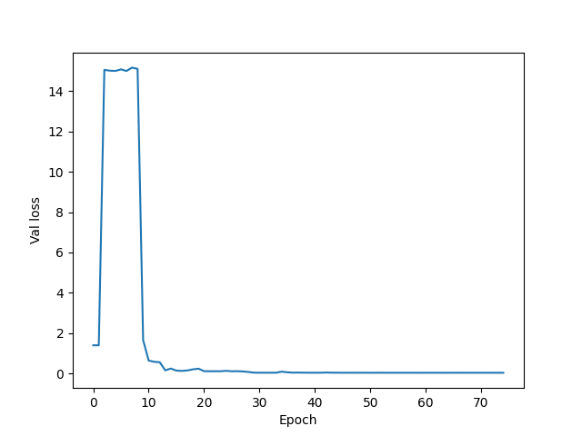

# Inverse EM field constructor

Goal: 
- construct an arrangement of magnets that produces a desired magnetic field

Approach: 
1. train a neural network to predict properties of a single magnet given the magnetic field it produces
2. input a desired magnetic field into the model
3. subtract the magnetic field produced by the magnet it outputs
4. repeat this cycle 

## Results 

A ResNet50 model was trained on 60000 data points (cuboidal magnets in a 2D plane). 

*Results from first attempt:*

- x position - MAE: 0.043976% 
- y position - MAE: 0.043822% 
- d imension a - MAE: 3.798878% 
- dimension b - MAE: 3.903161% 
- Mx magnetization - MAE: 13.210454% 
- My magnetization - MAE: 13.171558% 

(The script was containerised using Docker and ready to run in Google Cloud, but GPUs were unavailable so I ended up running it locally but storing the dataset in Google Cloud.)

## Files 

[run.py](run_train.py), [data.py](data.py), [model.py](model.py), [config.py](config.py) are the core files required to generate data, use Google Cloud, and train the model. 

[Dockerfile](Dockerfile), [docker-compose.yaml](docker-compose.yaml) are needed to containerise this process. (I made some notes [here](scratch/docker-gcloud-notes).)

[E_field_notebook](1_initial_attempt/E_field_notebook.ipynb) notebook contains initial attempts create a convolutional NN for an electric field
